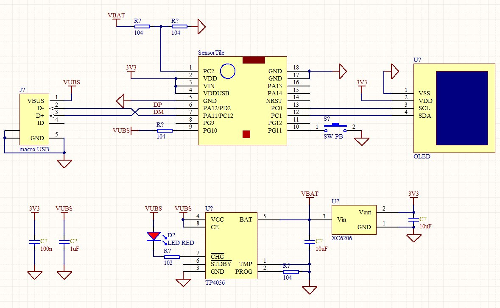

# SensorTile Pocket Watch

# 开源的 SensorTile 智能怀表

使用ST SensorTile开发板做的智能怀表，可以显示时间、传感器数据。已经实现了基本功能，下一步还将自动记录数据和分析数据，并通过蓝牙上传。

本项目的创新在于完全使用了MicroPython进行软件开发，并将SensorTile安装到了怀表中，可以实现完整的怀表功能。使用MicroPython读取SensorTile传感器，并在OLED上显示出来。怀表的按钮除了可以开盖，也兼作唤醒开关和功能切换键，每按一次切换一个功能界面，长按将自动复位。USB接口除了可以作为micropython的程序下载接口，还可以给电池充电。

使用前需要先通过接口板将MicroPython固件下载到SensorTile中，然后才可以通过MicroPython编程。因为MicroPython官方还没有支持SensorTile，所以SenSorTile的MicroPython固件需要自己移植，可以使用我移植好的，也可以自己编译源码。下载固件时，需要注意不能使用dfu方式，因为目前的dfu工具对于STM32L476存在问题，下载后的程序不完整，不能运行。目前可以通过STLink和STM32 ST-LINK Utility进行下载。

https://github.com/shaoziyang/MicroPython_firmware/tree/master/SensorTile

## 原理图

## 已知问题

* 目前MicroPython对RTC和外中断唤醒部分的功能存在问题，不能正常唤醒STM32L476（同样代码在STM32F401/F405上功能是正常的），因此低功耗部分存在缺陷。暂时使用machine.idle()，等外中断功能修正后，就可以改用machine.sleep()或machine.deepsleep()，进一步降低功耗。
* 蓝牙BLE部分的功能还没有实现。

MicroPython中文社区
http://www.micropython.org.cn

